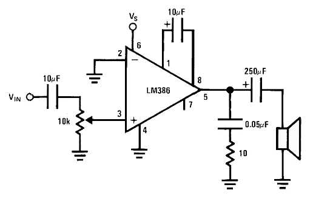

# "Laisse moi te raconter un objet"

This project aims to use an old rotary phone, and allows user to dial a specific number related to an audio file (a memory). From time to time, the phone will ring by itself, as if a memory want to call you.

## List of materials

- A rotaty phone (here, a Socotel S63)
- Arduino MKRZero ([link to store](https://store.arduino.cc/products/arduino-mkr-zero-i2s-bus-sd-for-sound-music-digital-audio-data))
- MKR Proto Shield ([link to store](https://store.arduino.cc/collections/shields-carriers/products/mkr-proto-shield?_pos=6&_fid=c9b0e8a56&_ss=c))
- Low-power audio amplifier LM386
- 10 kΩ potentiometer
- 10 Ω resistor
- 2 x 10 µF capacitor
- 0.05 or 0.1 µF capacitor
- 250 µF capacitor
- Jumper wires

## Audio amplifier circuit

In order to connect both speaker of the rotary phone to the Arduino, we need to amplify the signal using an LM386 amplifier. Here's the basic schematics we'll be using for this project :

